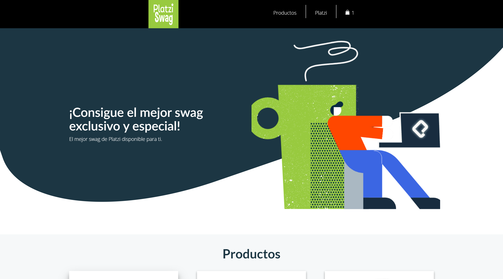

# Platzi Swag (Gatsby)

¡Bienvenido y gracias por visitarme! Este es un proyecto elaborado como proyecto de aprendizaje de Gatsby en [Platzi](https://platzi.com/cursos/gatsby/) en donde aplico varios de los conocimientos y habilidades adquiridas, entre ellas:

- Instalar y configurar Gatsby desde cero
- Crear vistas de una app web con Gatsby y React
- Conectar tu aplicación en Gatsby a una API en GraphQL
- Crear páginas web programáticamente

## Vista de Home

[Ver Home](https://ps-diegoalesco95.netlify.app)

## Licencia

[MIT License](LICENSE)
